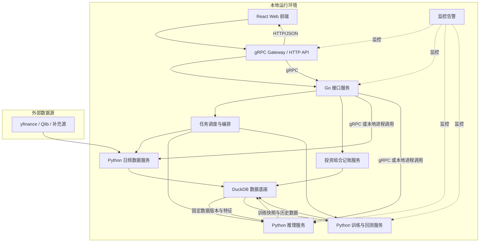

# 系统架构

本文档描述 GuanLan 的架构边界、模块划分、数据流和当前阶段 API。技术栈细节见 [04-tech-stack.md](./04-tech-stack.md)。

## 1. 架构概览

## 2. 分层职责

| 层级 | 职责 |
|------|------|
| 展示层 | 页面展示、日频图表、资产图表、任务查看、状态追踪和用户交互 |
| 网关层 | gRPC Gateway，对外提供 HTTP/JSON API，对内转发到 Go gRPC 接口 |
| 接口层 | Go gRPC 服务、路由校验、任务触发和状态聚合 |
| 业务层 | 数据任务编排、投资组合记账、每日分析、结果追溯和告警处理 |
| 数据层 | 原始数据、标准化数据、投资组合流水、资产快照、特征数据和版本管理 |
| Python 能力层 | 日频数据获取、特征工程、模型训练、回测和推理 |

## 3. 核心模块

| 模块 | 职责 |
|------|------|
| gRPC Gateway | 对外暴露 HTTP/JSON API，处理协议转换和基础错误映射 |
| Go 接口服务 | 承接 gRPC 接口、输入校验、任务创建、状态聚合和前端查询 |
| 数据获取 | 以 `stock_pool` 数据底座股票池为范围接入数据源，执行日频初始化、增量更新、质量验证和异常重试 |
| 数据底座 | 管理 DuckDB 表（含 `stock_pool`）、数据版本、训练快照和特征数据 |
| 任务调度 | 统一创建、触发、重试和记录数据/分析/训练/回测任务 |
| 数据图表 | 读取日频行情和质量状态，展示个股价格、成交量和可用区间 |
| 股票池（数据底座） | DuckDB `stock_pool`：`yfinance_symbol`（主键）、`original_code`、市场、`source`（`csv_import` / `api_manual`） |
| 关注列表 | DuckDB `watchlist_items`：用户关注；添加时自动写入 `stock_pool`（`source=api_manual`） |
| 投资组合记账 | 管理交易、分红、现金流、持仓重算、资产快照和年度汇总 |
| 特征工程 | 构建技术指标、因子、标准化结果和特征版本 |
| 模型训练 | 批量训练、验证、超参优化和模型导出 |
| Python 推理服务 | 执行每日批量分析，生成信号、置信度和风险结果 |
| 回测框架 | 基于固定数据版本运行回测并生成报告 |
| 监控告警 | 监控数据、任务和服务状态，生成失败摘要和告警 |

## 4. 数据流

| 流程 | 路径 |
|------|------|
| 股票池入库 | `scripts/import_stock_pool_csv.py` 导入 CSV → `stock_pool`；或 API `POST /api/data/pool/items` 手动添加 |
| 股票池日频入库 | 定时 `daily-sync` → Python `services.daily_data` 读取 `stock_pool` → 清洗校验 → 入库 |
| 用户关注入库 | 用户添加股票代码 → 写入 `watchlist_items` 并 `EnsureStockInPool` → 缺失时创建 `data_sync` 任务 → Python 日频数据服务 |
| 日频图表 | 页面请求 → 股票代码/日期范围 → 读取标准化日频表 → 返回价格、成交量和质量状态 |
| 股票池管理 | 页面操作 → gRPC Gateway → Go 接口服务 → 股票代码校验 → 写入 `watchlist_items` → 同步 `stock_pool` |

## 4.1 Python 服务边界

| 服务 | 模块 | 职责 |
|------|------|------|
| 日频数据 | `services.daily_data` | `daily-sync`、`run-scheduler`；从 `stock_pool` 拉 yfinance 行情 |
| 模型训练 | `services.training` | 读取 DuckDB 特征与标签，训练并导出模型（当前为占位） |

Go API 通过 `uv run python -m services.daily_data` 调用日频服务；训练服务独立运行，不与行情拉取混用。
| 交易入账 | 交易记录 → 持仓重算 → 现金余额更新 → 已实现盈亏更新 |
| 分红入账 | 分红记录 → 现金余额增加 → 持仓总成本下调 → 平均成本更新 |
| 资产估值 | 估值快照/收盘价导入 → 持仓市值计算 → 资产快照 → 总资产图表 |
| 年度复盘 | 年份过滤 → 交易/分红/现金流/估值聚合 → 年度报表和贡献图表 |
| 每日分析 | 调度器 → 数据版本校验 → 特征读取 → Python 推理服务 → 信号生成 → 结果入库 → 页面展示 |
| 模型训练 | 固定数据版本 → 特征工程 → 训练 → 验证 → 模型导出 → 模型版本登记 |
| 回测 | 参数选择 → 数据版本读取 → 回测执行 → 报告生成 → 结果追溯 |
| 监控 | 指标采集 → 异常检测 → 告警判断 → 页面展示 |

## 5. 当前阶段对外 API

外部访问统一经过 gRPC Gateway。前端使用 HTTP/JSON 端点，Go 接口服务对内以 gRPC 方法承接并编排 Python 日频数据服务和 Python 推理服务。

| 端点 | 说明 |
|------|------|
| `/api/data/stocks` | 股票池个股数据状态（基于 `stock_pool`） |
| `/api/data/stocks/{stock_code}/daily-bars` | 个股日频行情，用于图表展示 |
| `/api/data/stocks/{stock_code}/sync` | 为指定股票创建或重试日频数据获取任务 |
| `/api/data/tasks` | 数据任务记录 |
| `/api/data/pool` | 数据底座股票池列表（可按 `source` 筛选） |
| `/api/data/pool/items` | 手动添加股票池条目（`source=api_manual`） |
| `/api/watchlist` | 用户关注列表 |
| `/api/watchlist/items` | 添加指定股票代码到股票池 |
| `/api/watchlist/items/{stock_code}` | 删除或停用股票池中的指定股票代码 |
| `/api/portfolio/trades` | 交易记录 |
| `/api/portfolio/dividends` | 现金分红记录 |
| `/api/portfolio/cash-flows` | 出入金记录 |
| `/api/portfolio/positions` | 持仓状态和盈亏概览 |
| `/api/portfolio/valuations` | 手动估值快照和收盘价导入 |
| `/api/portfolio/assets` | 总资产、现金余额和资产图表数据 |
| `/api/portfolio/annual-reviews` | 年度复盘汇总和跨年对比 |
| `/api/portfolio/exports` | 交易、分红和估值快照导出 |
| `/api/analysis/run` | 手动触发每日分析 |
| `/api/analysis/results` | 分析结果和历史 |
| `/api/training/tasks` | 训练任务记录 |
| `/api/backtest/tasks` | 回测任务 |
| `/api/backtest/reports` | 回测报告 |
| `/api/system/status` | 系统状态 |
| `/api/alerts` | 告警列表 |

## 6. 当前阶段不承诺

- WebSocket 实时行情推送。
- 自动交易接口。
- 券商自动同步。
- 多用户认证和权限模型。
- 复杂税务核算。
- 外部平台开放 API。
