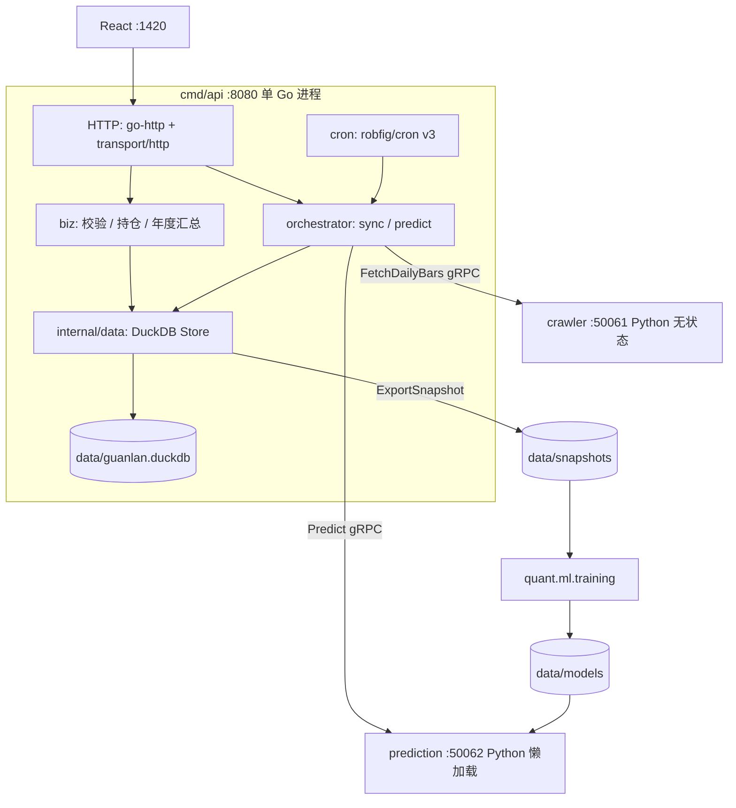

# 系统架构

本文档描述 GuanLan 的架构边界、模块划分、数据流和当前阶段 API。技术栈细节见 [04-tech-stack.md](./04-tech-stack.md)；阶段推进见 [05-roadmap.md](./05-roadmap.md)。

## 1. 架构概览

三进程模型：仅 `cmd/api` 打开 `data/guanlan.duckdb`。Python crawler / prediction **无状态**，不直连应用库。

同步链路：cron 或 HTTP 触发 → orchestrator 领取任务 → crawler 取数（每股一消息）→ `Store.IngestDailyBars` 写库 → 更新任务状态。

预测链路：`POST /api/analysis/run` 入队，或 `POST /api/analysis/predict` 按需调用 → prediction gRPC → `predictions` 表 → `GET /api/analysis/results`。

## 2. 分层职责

| 层级 | 职责 |
|------|------|
| 展示层 | 页面展示、日频图表、资产图表、任务查看、状态追踪和用户交互 |
| HTTP 层 | `cmd/api` 上的 Kratos `transport/http` + `protoc-gen-go-http`，对外 `/api/...` |
| 业务层 | `internal/biz`：输入校验、持仓重算、同步/分析任务策略 |
| 编排层 | `internal/orchestrator` + `internal/cron`：任务轮询、crawler/prediction 出向、定时入队 |
| 数据层 | `internal/data`：CRUD、ingest、快照导出、schema；**无出向 RPC** |
| Python 能力层 | crawler 拉行情；training 读 Parquet 快照；serving 懒加载模型做推理 |

## 3. 核心模块

| 模块 | 职责 |
|------|------|
| `cmd/api` | HTTP、DuckDB、编排、cron 合一进程 |
| 数据获取 | crawler `FetchDailyBars`；Go 写 `daily_bars` |
| 数据底座 | DuckDB 表（含 `stock_pool`）、数据版本、训练快照、`predictions` / `model_versions` |
| 任务调度 | 统一创建、触发、重试；`data_sync` / `analysis` 等 |
| 关注列表 | `watchlist_items`；添加时写入 `stock_pool`，缺数据则建同步任务 |
| 投资组合记账 | 交易、分红、现金流、持仓重算、资产快照和年度汇总 |
| 特征工程 | `quant/ml/features`：training / serving 共用列定义 |
| Python 推理 | `quant.ml.serving`：懒加载 `data/models/*.json`（无产物时 gRPC UNIMPLEMENTED） |
| 监控 | `/healthz`、`/metrics` |

## 4. 数据流

| 流程 | 路径 |
|------|------|
| 股票池入库 | `uv run python -m quant.tools.pool_csv --csv ...` 经 HTTP `POST /api/data/pool/items` |
| 股票池日频入库 | cron 入队 → crawler gRPC → `IngestDailyBars` |
| 用户关注入库 | 添加关注 → `EnsureStockInPool` → 缺失则 `data_sync` |
| 日频图表 | `GET /api/data/stocks/{code}/daily-bars` |
| 每日分析 | `POST /api/analysis/run` → prediction gRPC → `predictions` |
| 按需预测 | `POST /api/analysis/predict` 同步走 prediction |
| 模型训练 | `COPY TO PARQUET` 快照 → `python -m quant.ml.training` → `data/models`（不打开应用 DuckDB） |
| 交易入账 | 交易记录 → 持仓重算 → 现金余额 / 已实现盈亏 |
| 分红入账 | 分红 → 现金增加 → 总成本下调 |
| 年度复盘 | 年份过滤流水与快照 → 报表 |

## 5. 当前阶段对外 API

前端只访问 `cmd/api` 的 HTTP/JSON（Vite 将 `/api` 代理到 `:8080`）。crawler / prediction 仅进程内 gRPC。

| 端点 | 说明 |
|------|------|
| `/api/data/stocks` | 股票池个股数据状态 |
| `/api/data/stocks/{stock_code}/daily-bars` | 个股日频行情 |
| `/api/data/stocks/{stock_code}/sync` | 创建日频同步任务 |
| `/api/data/tasks` | 数据任务记录 |
| `/api/data/pool` | 数据底座股票池 |
| `/api/data/pool/items` | 手动添加股票池条目 |
| `/api/watchlist` | 用户关注列表 |
| `/api/watchlist/items` | 添加关注 |
| `/api/watchlist/items/{stock_code}` | 删除或停用 |
| `/api/portfolio/trades` | 交易记录 |
| `/api/portfolio/dividends` | 现金分红 |
| `/api/portfolio/cash-flows` | 出入金 |
| `/api/portfolio/positions` | 持仓 |
| `/api/portfolio/valuations` | 估值快照 |
| `/api/portfolio/assets` | 总资产与快照 |
| `/api/portfolio/annual-reviews` | 年度复盘 |
| `/api/analysis/run` | 入队批量分析 |
| `/api/analysis/predict` | 按需单票预测 |
| `/api/analysis/results` | 预测结果列表 |
| `/api/tasks` | 统一任务列表 |
| `/healthz` `/metrics` | 健康与指标 |

尚未实现（见产品范围）：`/api/training/tasks`、`/api/backtest/*`、`/api/alerts`、`/api/system/status`、组合导出。

## 6. 当前阶段不承诺

- WebSocket 实时行情推送。
- 自动交易接口。
- 券商自动同步。
- 多用户认证和权限模型。
- 复杂税务核算。
- 外部平台开放 API。
